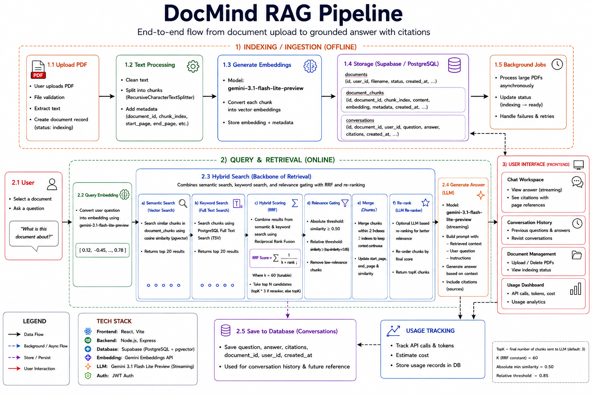

# DocMind

> AI-powered PDF question answering with multi-user support, streaming responses, and cited sources.

[](https://dom-mind-rag-chat-bot.vercel.app/)
[](https://dommind-rag-chatbot.onrender.com/health)
[](https://supabase.com/)

**[→ Try the live demo](https://dom-mind-rag-chat-bot.vercel.app/)**

Upload any PDF. Ask questions about it in plain English. Get answers with exact page citations — streamed token by token.

---

## Demo



*Upload a PDF → Ask questions → Get streamed answers with page citations*

## What makes this different

Most RAG tutorials build single-user, no-auth systems with basic vector search. DocMind implements what production RAG actually requires:

- **Hybrid search** — semantic vector search + PostgreSQL full-text search combined with Reciprocal Rank Fusion, handling both conceptual questions and exact-term queries
- **Relevance gating** — chunks below a similarity threshold never reach the LLM, preventing hallucination from irrelevant context
- **Database-level isolation** — PostgreSQL Row Level Security enforces user data separation at the database engine level, not just the application layer
- **Prompt injection defence** — retrieved document content is explicitly labelled as untrusted in the system prompt, preventing malicious PDFs from hijacking model behaviour
- **Streaming with citations** — answers appear token-by-token via SSE; citations appear as a separate event after the stream completes

---

## Architecture

```text
┌─────────────────────────────────────────────────────────────────┐
│                        React Frontend                           │
│   Login/Register → Document List → Upload → Chat Interface      │
│   Streaming consumer (SSE) | Citation panel | History sidebar   │
└──────────────────────────┬──────────────────────────────────────┘
                           │ HTTPS + JWT
                           ▼
┌─────────────────────────────────────────────────────────────────┐
│                     Express.js API                              │
│                         Render                                  │
│                                                                 │
│  POST /auth/register   POST /auth/login    GET /auth/me         │
│  POST /upload          GET /documents     DELETE /documents    │
│  POST /ask-stream      GET /conversations GET /usage           │
│                                                                 │
│  Middleware: verifyToken → RLS context → route handler          │
└────────────┬────────────────────┬───────────────────────────────┘
             │                    │
             │                    │
┌────────────▼──────────┐  ┌─────▼──────────────────────────────┐
│   Gemini API          │  │   Supabase PostgreSQL               │
│                       │  │                                     │
│ gemini-embedding-001  │  │  users          (JWT auth)          │
│ → 3072-dim vectors    │  │  documents      (status tracking)   │
│                       │  │  chunks         (vector(3072))      │
│ gemini-3.1-flash-lite │  │  conversations  (history per doc)   │
│ -preview              │  │  evaluation_logs (RAG evaluation)  │
│ → streamed answers    │  │  api_usage_logs (cost tracking)    │
│                       │  │                                     │
│  Token usage tracked  │  │  pgvector + PostgreSQL FTS          │
│  per Gemini call      │  │  RLS policies enforce user          │
│                       │  │  isolation at the DB level          │
└───────────────────────┘  └─────────────────────────────────────┘

```
## RAG Pipeline

```text

User question
     │
     ├──────────────────────────────┐
     │                              │
     ▼                              ▼
generateEmbedding()          plainto_tsquery()
     │                              │
     ▼                              ▼
semanticSearch()            keywordSearch()
(pgvector cosine sim)       (PostgreSQL FTS)
     │                              │
     └──────────┬───────────────────┘
                │
                ▼
    Reciprocal Rank Fusion (K=60)
                │
                ▼
    applyRelevanceGate()
    (ABSOLUTE_MINIMUM=0.50, RELATIVE=0.85)
                │
                ▼
    mergeAdjacentChunks()
                │
                ▼
    Optional LLM Re-ranking
                │
                ▼
    buildSecurePrompt()
    (injection defence)
                │
                ▼
    generateContentStream()
    (SSE token-by-token)
                │
                ▼
    citations event → done event
                │
                ▼
    INSERT conversations
    + api_usage_logs
    + evaluation_logs
```

---

## Tech Stack

| Layer | Technology |
|---|---|
| Frontend | React 18, Vite |
| Backend | Node.js, Express.js |
| Database | Supabase PostgreSQL |
| Vector Search | pgvector |
| Full-Text Search | PostgreSQL Full-Text Search |
| AI / Embeddings | Google Gemini API |
| Embedding Model | `gemini-embedding-001` (3072 dimensions) |
| Generation Model | `gemini-3.1-flash-lite-preview` |
| Auth | JWT (`jsonwebtoken` + `bcrypt`) |
| File Upload | Multer |
| PDF Parsing | `pdf-parse` v2.4.5 |
| Deployment | Render (backend), Vercel (frontend), Supabase (database) |
| Security | PostgreSQL Row Level Security, JWT authentication, prompt injection defence |

---

## Features

- **Multi-user auth** — JWT-based registration and login
- **PDF upload** — async indexing with real-time progress tracking
- **Hybrid semantic + keyword search** — vector search + PostgreSQL FTS combined with Reciprocal Rank Fusion
- **Relevance gating** — filters weak retrieval results before generation
- **Optional re-ranking** — improves ordering of retrieved candidates before generation
- **Streaming answers** — token-by-token via Server-Sent Events
- **Page citations** — answers reference exact page numbers from the source PDF
- **Conversation history** — persistent per-document Q&A threads
- **Data isolation** — PostgreSQL RLS + application-layer `user_id` filtering
- **Prompt injection defence** — document content labelled as untrusted
- **Cost tracking** — every Gemini API call logged with token counts
- **Usage dashboard** — per-user token consumption and estimated cost
- **RAG evaluation logging** — retrieval quality metrics stored separately from API usage

---

## Running Locally

### Prerequisites

- Node.js 18+
- PostgreSQL with pgvector extension installed
- Google Gemini API key

### Backend Setup

```bash
git clone https://github.com/YOUR_USERNAME/docmind.git
cd docmind/backend
npm install
```

Create `.env`:

```env
GEMINI_API_KEY=your_gemini_api_key

JWT_SECRET=your_long_random_secret
JWT_EXPIRES_IN=7d
BCRYPT_ROUNDS=10

DATABASE_URL=your_application_database_url
ADMIN_DATABASE_URL=your_admin_database_url

NODE_ENV=development
PORT=3000
CLIENT_URL=http://localhost:5173
```

Create the database and run the schema:

```sql
-- In psql as PostgreSQL administrator
CREATE DATABASE PdfParse_semantic_db;

\c semantic_search_db
```

Then:

```bash
psql -U postgres -d PdfParse_semantic_db -f schema.sql
```

Start the backend:

```bash
npm start
```

Server:

```text
http://localhost:3000
```

Verify:

```text
GET http://localhost:3000/health
```

### Frontend Setup

```bash
cd ../frontend
npm install
```

Create `.env.local`:

```env
VITE_API_URL=http://localhost:3000
```

Start the frontend:

```bash
npm run dev
```

App:

```text
http://localhost:5173
```

---

## Production Architecture

DocMind is deployed using three separate services:

```text
                    ┌───────────────┐
                    │    Vercel     │
                    │ React Frontend│
                    └───────┬───────┘
                            │
                            │ HTTPS + JWT
                            ▼
                    ┌───────────────┐
                    │    Render     │
                    │ Express API   │
                    └───────┬───────┘
                            │
                 ┌──────────┴──────────┐
                 │                     │
                 ▼                     ▼
        ┌─────────────────┐   ┌─────────────────┐
        │ Supabase        │   │  Gemini API     │
        │ PostgreSQL      │   │                 │
        │ + pgvector      │   │ Embeddings      │
        │ + RLS           │   │ + Generation    │
        └─────────────────┘   └─────────────────┘
```

### Production responsibilities

#### Vercel

- React frontend
- Static assets
- Client-side application
- API requests to Render

#### Render

- Express.js backend
- JWT authentication
- PDF processing
- Async indexing
- Hybrid retrieval
- RRF
- Re-ranking
- Gemini API calls
- SSE streaming

#### Supabase

- PostgreSQL database
- pgvector
- PostgreSQL Full-Text Search
- Row Level Security
- Persistent application data

---

## Environment Variables

### Backend — Render

| Variable | Description |
|---|---|
| `GEMINI_API_KEY` | Google Gemini API key |
| `JWT_SECRET` | Secret used to sign JWT tokens |
| `JWT_EXPIRES_IN` | JWT expiration period |
| `BCRYPT_ROUNDS` | bcrypt hashing cost |
| `DATABASE_URL` | Application PostgreSQL connection string |
| `ADMIN_DATABASE_URL` | Admin/authentication PostgreSQL connection string |
| `NODE_ENV` | Set to `production` |
| `PORT` | Provided by Render |
| `CLIENT_URL` | Production Vercel frontend URL |

> Database credentials and API keys are stored as Render environment variables and are not committed to Git.

### Frontend — Vercel

| Variable | Description |
|---|---|
| `VITE_API_URL` | Production Render backend URL |

Example:

```env
VITE_API_URL=https://your-backend.onrender.com
```

---

## Database Security

DocMind uses PostgreSQL Row Level Security (RLS) to enforce user-level data isolation.

The backend uses a dedicated application database role for normal user-data queries and an administrative connection only where elevated database privileges are required.

For authenticated requests:

```text
JWT
 │
 ▼
verifyToken
 │
 ▼
req.user.id
 │
 ▼
Set PostgreSQL RLS context
 │
 ▼
RLS-aware database connection
 │
 ▼
PostgreSQL RLS policy
 │
 ▼
Only the authenticated user's rows
```

This provides multiple layers of protection:

1. **JWT authentication** — verifies the identity of the requester
2. **Application-layer filtering** — user-owned resources are checked using `user_id`
3. **PostgreSQL RLS** — database policies enforce user isolation
4. **Database roles** — application and administrative database access are separated

---

## Security Architecture

Three layers of data isolation:

1. **JWT middleware** — every protected request must carry a valid signed token
2. **Application-layer filtering** — user-owned resources are checked using `user_id`
3. **PostgreSQL RLS** — policies enforce isolation at the database engine level

For example, even if an application query accidentally omits an ownership condition, PostgreSQL RLS can prevent access to another user's rows.

### Prompt Injection Defence

Retrieved document content is explicitly labelled as:

```text
UNTRUSTED USER-UPLOADED CONTENT
```

in the generation prompt.

The model is instructed to treat document content as data rather than instructions and to report suspicious prompt-injection attempts instead of following them.

---

## API Reference

| Method | Endpoint | Auth | Description |
|---|---|---|---|
| `POST` | `/auth/register` | None | Create account |
| `POST` | `/auth/login` | None | Login, receive JWT |
| `GET` | `/auth/me` | JWT | Get current user |
| `POST` | `/upload` | JWT | Upload and index a PDF |
| `GET` | `/documents` | JWT | List user's documents |
| `GET` | `/documents/:id` | JWT | Get document + indexing progress |
| `DELETE` | `/documents/:id` | JWT | Delete document and all chunks |
| `POST` | `/ask-stream` | JWT | Ask question, SSE stream response |
| `POST` | `/ask` | JWT | Ask question, JSON response |
| `GET` | `/conversations/:docId` | JWT | Get conversation history for document |
| `DELETE` | `/conversations/:docId/:id` | JWT | Delete a conversation entry |
| `GET` | `/usage` | JWT | Get API usage summary |
| `GET` | `/health` | None | Health check |

---

## Author

**[Mitul Patil]**

Portfolio: [Portfolio](https://portfolio-coral-three-66.vercel.app/)

LinkedIn: [LinkedIn](https://www.linkedin.com/in/mitul-patil-471456256)

GitHub: [@MitulPatil]
